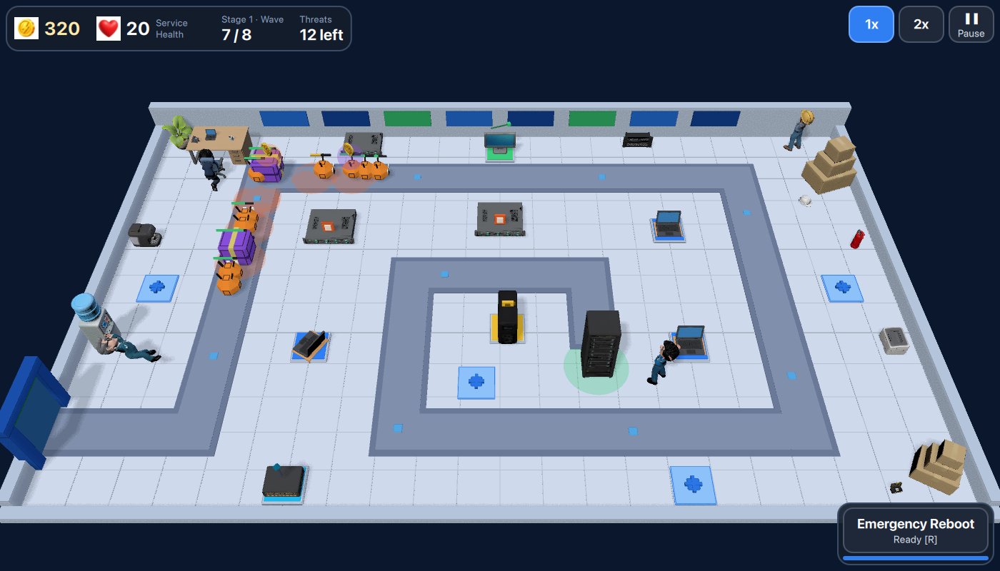
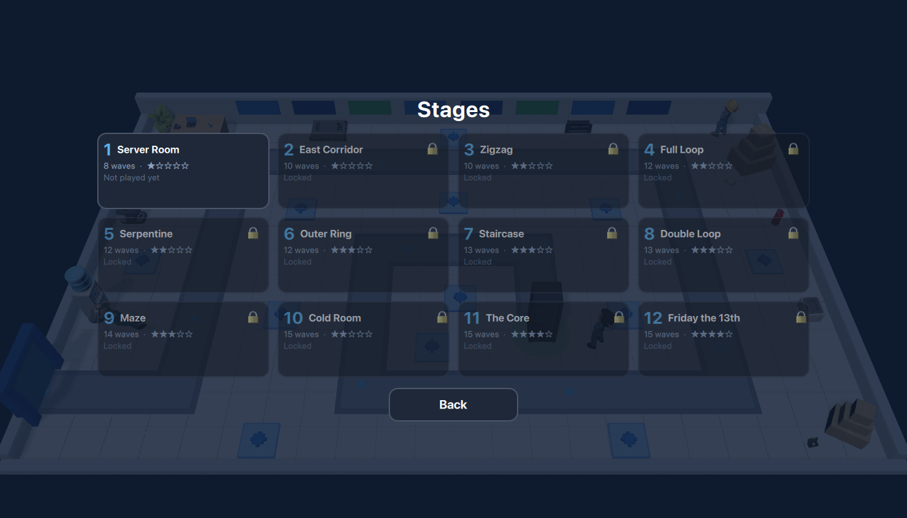

# Operação TI: Defenda o Datacenter

*English default in-game; this README is in Portuguese. Play in the browser: https://fernandotonon.github.io/it-operation-td/*

**Um tower defense 3D leve e bem-humorado, feito com [Clayground](https://github.com/MisterGC/clayground);
equipamentos e técnicos gerados a partir das imagens de referência *Operação TI* no
[QtMeshEditor](https://github.com/fernandotonon/QtMeshEditor).**

Sexta-feira, 17h. A equipe de TI já ia embora quando o painel de monitoramento acendeu. Coloque
Estações de Patch, Firewalls, Controladores de Tráfego, Scanners de Segurança e Estações de Backup ao
lado da rota de cabos, sobreviva a quinze ondas de ameaças de desenho animado e ao chefe final, o
**Deploy de Sexta**. Inglês por padrão; português (BR) e alemão nos ajustes. Sem internet, sem contas, sem anúncios.



## Requisitos

| Ferramenta | Versão | Observações |
|---|---|---|
| Qt | **6.10+** (desenvolvido com 6.11.1) | kit desktop com Qt Quick 3D, Quick 3D Physics (dependência do Clayground), Quick Timeline, Multimedia, Shader Tools |
| CMake ≥ 3.25, Ninja, um compilador C++17 | | em Apple Silicon use um CMake arm64 (um CMake x86_64 configura o build errado) |
| Node 20+ | opcional | só para `node tests/sim.test.js` |
| QtMeshEditor 3.39+ | opcional | só para (re)gerar assets; não é necessário para compilar ou jogar |

## Compilar e executar

```bash
git clone --recursive https://github.com/fernandotonon/it-operation-td.git
cd it-operation-td
git submodule update --init --recursive        # se esqueceu o --recursive

export QT_ROOT=~/Qt/6.11.1/macos               # ou .../gcc_64, .../msvc2022_64
cmake --preset desktop
cmake --build --preset desktop --target operacao_ti
./build-desktop/bin/operacao_ti.app/Contents/MacOS/operacao_ti      # macOS
./build-desktop/bin/operacao_ti                                     # Linux

ctest --preset desktop                          # smoke test headless + regras da simulação (node)
node tests/sim.test.js                          # só as regras, sem Qt, em ~1 s
node tests/balance-probe.mjs                    # bots de várias habilidades jogam as 15 ondas
```

Clayground é um submódulo git (`external/clayground`) compilado junto; não há nada para instalar. O
plugin `clay_ai` do Clayground baixa o llama.cpp no configure; num `CMakeUserPresets.json` (ignorado
pelo git) você pode apontar `FETCHCONTENT_SOURCE_DIR_LLAMA_CPP` para um checkout existente.

### Versão web (WebAssembly + GitHub Pages)

```bash
scripts/build-wasm.sh                        # kit Qt wasm_multithread 6.11.1 + emsdk 4.0.7 -> deploy/multithread/
python3 scripts/serve.py deploy/multithread  # teste local com cabeçalhos COOP/COEP
node scripts/browser-check.mjs http://localhost:8080/ --seconds 40   # Chrome headless: console + captura
scripts/deploy-pages.sh                      # publica deploy/multithread no branch gh-pages
```

Online: https://fernandotonon.github.io/it-operation-td/ — o `opti-sw.js` (service worker) fornece o isolamento
cross-origin que o GitHub Pages não consegue configurar e guarda os arquivos do jogo no navegador.

### Desenvolvimento com o Dojo (live reload)

```bash
# um build do Clayground com as ferramentas (uma vez)
cd external/clayground && cmake -S . -B build -G Ninja -DCMAKE_PREFIX_PATH=$QT_ROOT -DBUILD_TESTING=OFF \
    -DCLAYGROUND_WITH_EXAMPLES=OFF && cmake --build build && cd ../..

QT_DISABLE_SHADER_DISK_CACHE=1 external/clayground/build/bin/claydojo --sbx app/Sandbox.qml
external/clayground/build/bin/clayrender app/Sandbox.qml --out shot.png --size 1400x800 \
    --eval 'game.debugStart(7)' --eval 'game.debugAdvance(20)'        # um estado qualquer, sem sessão
```

`game.debugStart(n, layout?)` monta uma defesa e começa na onda *n*; `game.debugAdvance(s)` avança *s*
segundos de simulação; `game.debugAutoplay()` joga a partida inteira com um bot; `flagInfo()` expõe o estado
ao inspector do Dojo. `app/CharacterPreview.qml` mostra um asset e um clipe de animação isolados
(`--set 'assetId="tech_polo"' --set 'clip="Cheer"'`). `scripts/screenshots.sh` refaz as capturas de `docs/screenshots/`.

## Fases

Doze fases, cada uma com sua rota e seus pontos de instalação (`app/config/stages.js`); vencer uma fase libera a
seguinte e o melhor resultado (saúde restante, tempo) fica salvo por fase. As primeiras têm menos ondas
(8, 10, 12…) e a última onda é sempre o Deploy de Sexta; a vida das ameaças cresce fase a fase.

| # | Fase | Ondas | Dif. | # | Fase | Ondas | Dif. |
|---|---|---|---|---|---|---|---|
| 1 | Sala de Servidores | 8 | ★ | 7 | Escadaria | 13 | ★★★ |
| 2 | Corredor Leste | 10 | ★ | 8 | Duplo Laço | 13 | ★★★ |
| 3 | Zigue-zague | 10 | ★★ | 9 | Labirinto | 14 | ★★★ |
| 4 | Volta Completa | 12 | ★★ | 10 | Sala Fria | 15 | ★★ |
| 5 | Serpentina | 12 | ★★ | 11 | Núcleo | 15 | ★★★★ |
| 6 | Anel Externo | 12 | ★★★ | 12 | Sexta-feira 13 | 15 | ★★★★ |

`node tests/stages.test.js` valida a geometria de todas as fases (rota dentro do tabuleiro, pontos fora da
rota, decoração sem cobrir pontos); `node tests/stage-balance.mjs` faz um bot jogar cada fase até o fim.



## Como jogar

* A interface tem um modo compacto para telas pequenas (celular em paisagem): os cartões de torre quebram em
  duas linhas quando não cabem ao lado do cartão da onda.
* Toque num **ponto azul** ao lado da rota e escolha uma torre (o círculo mostra o alcance antes de
  gastar). Toque de novo no cartão para comprar; `1`–`5` também escolhem.
* Toque numa torre para **melhorar** (2 níveis) ou **vender** (70% de volta).
* **Iniciar onda** (`espaço`) quando estiver pronto. `1x`/`2x` (`F`) e **Pausa** (`P`/`Esc`).
* **Reboot de Emergência** (`R`): toque no botão e depois no mapa. As torres da área ficam 3 s offline e
  voltam sem bloqueios e com turbo de velocidade por 6 s. Recarga de 45 s.
* Ameaças que chegam ao rack tiram **Saúde do Serviço**; zero é derrota. Limpar a onda 15 é vitória.

| Torre | Papel |
|---|---|
| Estação de Patch | dano em um alvo, barata |
| Firewall | dano em área (rajadas curtas) |
| Controlador de Tráfego | lentidão (máx. 50%, não acumula) |
| Scanner de Segurança | revela Pacotes Ocultos + dano moderado |
| Estação de Backup | não ataca; turbo de velocidade a torres vizinhas (não acumula) |

Ameaças: Bug, Pacote de Spam, Pacote Trojan (solta 3 Bugs), Pacote Oculto (só visível com Scanner),
Ransomware (bloqueia uma torre por 4 s) e o chefe Deploy de Sexta (solta Spam a 75/50/25% de vida).

## Estrutura

```
app/                 QML + JS do jogo (Main.qml entrada, Sandbox.qml para o Dojo)
  scripts/Sim.js     simulação completa, sem Qt (movimento, alvos, projéteis, efeitos, economia, ondas)
  config/            tabelas: stages.js (12 fases), towers.js, enemies.js, waves.js, tuning.js, strings.js, assets.js
  Board3D.qml        cena 3D (câmera fixa, rota, pontos, rack, decoração, pools de visuais)
  Hud.qml, *Overlay  interface 2D
assets/source-images cópias renomeadas das referências usadas; exported/ GLBs (+ <id>_trim.glb sem a base);
                     rigged/ técnicos com esqueleto e clipes; runtime/ import do balsam; audio/ cues sintetizados
reference/           as imagens de referência originais, intocadas
scripts/             pipeline de assets: generate-models.sh, trim-base.py, rig-character.sh, import-all.sh,
                     update-asset-manifest.py, gen-audio.py, screenshots.sh
tests/               sim.test.js (regras), stages.test.js (geometria das fases), stage-balance.mjs, balance-probe.mjs
docs/                asset-pipeline.md, qtmesh-games/operacao-ti.json (manifesto para o QtMesh Games)
```

Veja [docs/asset-pipeline.md](docs/asset-pipeline.md) para o fluxo QtMeshEditor → Clayground.

## Limitações conhecidas

* Os modelos vêm do preset `fast` (512) do TRELLIS.2 com o removedor de fundo de alta qualidade do
  QtMeshEditor (`--matting best`, BiRefNet): neste Mac os presets `balanced`/`high` travam num command buffer
  do Metal. Bastam para a câmera elevada, mas detalhes pequenos (teclas, portas) ficam suaves. O monitor
  precisou de outra semente (`SEED=7`) porque a primeira textura saiu embaralhada.
* As seis ameaças são personagens procedurais de caixas toon (`EnemyVisual.qml`): não havia referência
  fornecida e o gerador texto→imagem do QtMeshEditor (FLUX.2-klein) não está instalado nesta máquina.
* Sem trilha sonora: só cues curtos sintetizados por `scripts/gen-audio.py` (nenhuma fonte licenciada disponível).
* A ponte de eventos do QtMesh Games (conquistas via TCP) não foi implementada; o jogo roda sozinho e o
  manifesto de exemplo está em `docs/qtmesh-games/operacao-ti.json`.
* Personagens: além dos três técnicos, dois funcionários (`staff_02`, `staff_05`) foram gerados e animados; os
  outros 25 e três adereços (coração, recepção, estação de trabalho) ainda estão pendentes — a geração noturna
  falhou por falta de memória (UniRig + TRELLIS ao mesmo tempo). O roteiro para terminar está em
  `docs/asset-pipeline.md`, "Finishing the character set".
* Na web o jogo começa com "Menos efeitos" ligado (sem sombras/MSAA); ligue nos ajustes se a máquina aguentar.
  O anel de alcance é feito de segmentos de caixa porque o `Poly3D` do Clayground com furo travava a build WebAssembly.
* Medições de desempenho e as capturas foram feitas com `clayrender` (renderização offscreen); a jogabilidade
  com mouse/toque foi verificada pelas funções de entrada, não com um dispositivo de toque real.

## Licença

MIT (código deste repositório). Clayground é MIT; Qt sob suas próprias licenças. As imagens de
referência *Operação TI* pertencem ao projeto e não são redistribuídas sob a MIT.
